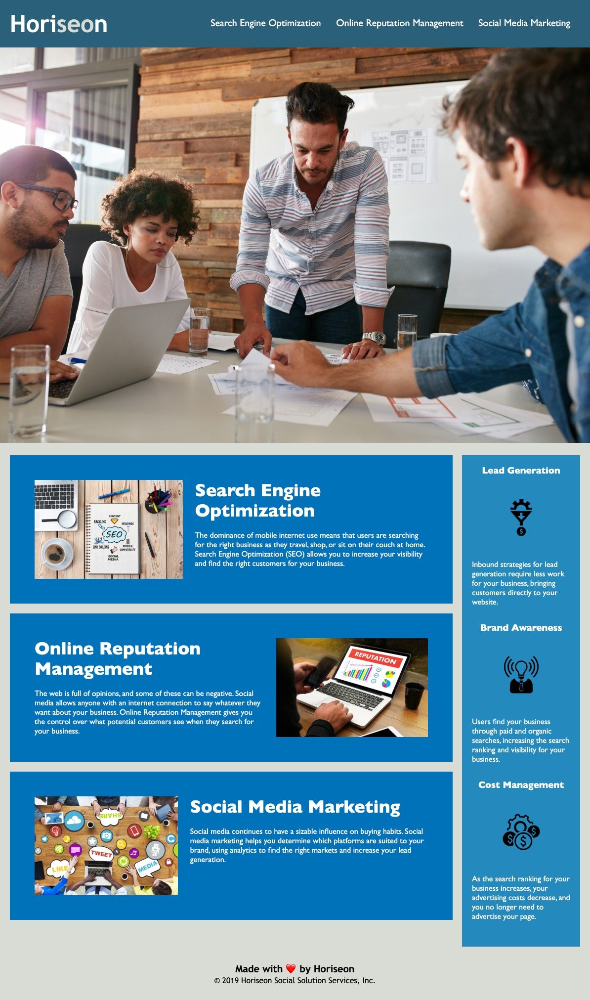

# Horiseon Code Refactor

## Link to the page:
https://jpecheverryp.github.io/horiseon-refactor/

## Mock Up:

## Introduction

The objective of this page is to show good habits and practices when it comes to write clean code, this is useful because it can be readable by other developers, it can be modified later very easily and it is easy to debug.
It also helps our page to appear on Google search, this is called Search Engine Optimization (SEO), and make our site more accesible.

## HTML 
### Semantic Elements
The HTML has different kind of elements, and some of them can give our sections meaning, while others like the div tag are more generic and we can use them to group elements that dont have to be independent.
The elements that we used on this site are header, article, section, aside, content, and footer. These elements help screen readers scan the whole page in a simple and easy way and it also helps with the SEO of our website.
### Alternative Text
We also added alternative text to the images of our website. These are descriptions of out images that we can add with attribute "alt". These appear when a link to an image is broken or when a screen reader gets to an image. it can slo help to the SEO because search engines cannot understand images butt they can search the text on them.
### Headings
We should only use one heading 1, this is the main title of our page, we can then add several headings 2 and the divide them in smaller headings if we have sub-information inside of them.
We should not use the numbers on the headings only for the size but taking care of the semantic of our page. We can then change the styling with CSS if we want to make them bigger or smaller.

## CSS
### Dry Rule (Don't Repeat Yourself)
A good rule for CSS is not repeating code, I added a class to all the similar and related sections, so I could change the CSS and avoid repetition. This works because I added a style that was getting repeated in all the sections in that class and then I just added the class to every element that was using that styling.
I also changed the order of the different sections on the CSS documents so they would appear by the order they appear in the HTML file. This helps with our order and we can find elements quickly when we get back to the code.

## Other Details
### Title
The title element in our head section is the text that will appear in the tab of our browser.
We should use text that will help our users know what that tab is about while they are on other tabs.
We chose Horiseon, the name of our company, and then a little description of what Horiseon provides.
### Comments
The comments in our code are extremely important. It helps other developers understand our code telling them why and how we make stuff work. It also is very handy when we are changing oour own code that we haven't seen in a while.